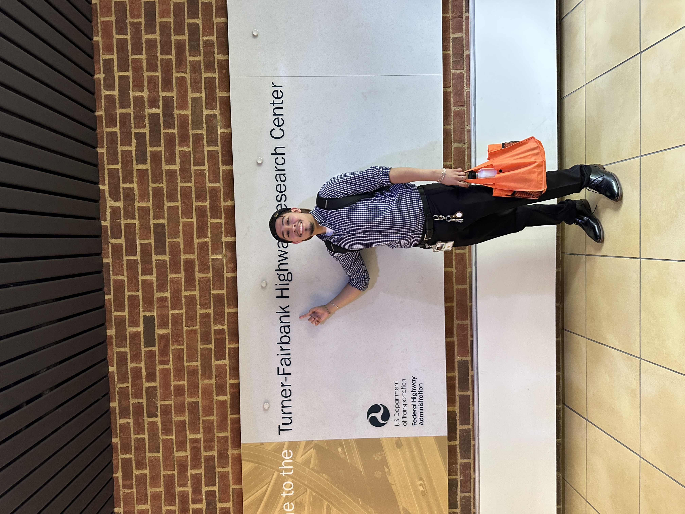

<h1 align="center"><b> Angel J. Haro 

</h1>

<!-- START  -->

&nbsp;
&nbsp;
&nbsp;
&nbsp;
&nbsp;
<h3 align="center"> <a href=https://aharoj.io> ··· VISIT PORTFOLIO ··· </a> </h3>

  
 
<!-- END -->

<!-- START -->
<table><tr><td valign="top" width="50%">

</td><td valign="top" width="50%">

</tr></tr></table> 
<!-- END -->

<!-- # ~~~~~~~~~~~~~~~~~~~~~~~~~~~~~     .................................       ~~~~~~~~~~~~~~~~~~~~~~~~~~~~~~ # -->
<h2 align="center"><a> About Me 🧍‍♂️ </a> </h2>

<!-- START -->
<table><tr><td valign="top" width="15%">
<h2 align="center"> <a> physical activities </a> </h2>

- gym
- soccer
- boxing
- skateboarding

</td><td valign="top" width="20%">
<h2 align="center"> <a> anime enthusiast </a> </h2>

- vinland
- fma
- aot
- demon slayer
- psycho-pass

</td><td valign="top" width="15%">
<h2 align="center"> <a> editor </h2>

- photoshop
- sony vegas pro
- elgato
- obs
- youtube

</td><td valign="top" width="50%">
<h2 align="center"> <a> video game enthusiast </a> </h2>

- U.S. regional professional player in FIFA
  -  17 | 19 | 21
- top 13 % in COD 
- top 5 % in warzone
- top 1 % in pubg
- FPS kill-to-death ratio 2.43
</tr></tr></table> 
<!-- END -->
<!-- # ~~~~~~~~~~~~~~~~~~~~~~~~~~~~~     .................................       ~~~~~~~~~~~~~~~~~~~~~~~~~~~~~~ # -->

<!-- # ~~~~~~~~~~~~~~~~~~~~~~~~~~~~~     .................................       ~~~~~~~~~~~~~~~~~~~~~~~~~~~~~~ # -->
<h2 align="center"> <a href="https://github.com/aharoJ/opensource"> opensource advocate </a> </h2>

- An open source advocate, committed to sharing my knowledge and expertise with the community.
<!-- START -->
<table><tr><td valign="top" width="33%">
<h2 align="center"> <a> opensource </a> </h2>

</td><td valign="top" width="33%">
<h2 align="center"> <a> starship </a> </h2>

</td><td valign="top" width="33%">
<h2 align="center"> <a> nextJs portfolio  </a> </h2>

</tr></tr></table> 
<!-- END -->
<!-- # ~~~~~~~~~~~~~~~~~~~~~~~~~~~~~     .................................       ~~~~~~~~~~~~~~~~~~~~~~~~~~~~~~ # -->

<!-- # ~~~~~~~~~~~~~~~~~~~~~~~~~~~~~     .................................       ~~~~~~~~~~~~~~~~~~~~~~~~~~~~~~ # -->
<!-- START -->
<table><tr><td valign="top" width="33%">
<h2 align="center"> <a> linksage </a> </h2>

</td><td valign="top" width="33%">
<h2 align="center"> <a> tmux </a> </h2>

</td><td valign="top" width="33%">
<h2 align="center"> <a> yabai  </a> </h2>

</tr></tr></table> 
 
<!-- END -->
<!-- # ~~~~~~~~~~~~~~~~~~~~~~~~~~~~~     .................................       ~~~~~~~~~~~~~~~~~~~~~~~~~~~~~~ # -->

<!-- # ~~~~~~~~~~~~~~~~~~~~~~~~~~~~~     .................................       ~~~~~~~~~~~~~~~~~~~~~~~~~~~~~~ # -->
<!-- START  -->

<table><tr><td valign="top" width="55%">

<!-- MID -->
</td><td valign="top" width="45%">

<!-- END  -->
<!-- # ~~~~~~~~~~~~~~~~~~~~~~~~~~~~~     .................................       ~~~~~~~~~~~~~~~~~~~~~~~~~~~~~~ # -->

