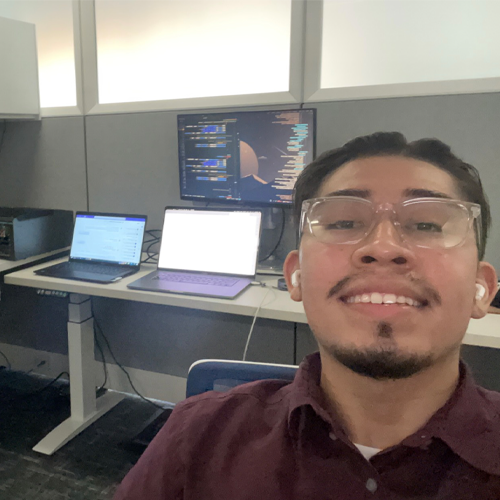

<!-- START -->
<h1 align="center"><b> Angel J. Haro 

</h1>
<!-- START  -->

&nbsp;
&nbsp;
&nbsp;
&nbsp;

  
 

<!-- # ~~~~~~~~~~~~~~~~~~~~~~~~~~~~~     .................................       ~~~~~~~~~~~~~~~~~~~~~~~~~~~~~~ # -->
<!-- START -->
<table>
  <tr>
    <td valign="top" width="50%">
      
    </td>
    <td valign="top" width="50%">
      
    </td>
  </tr>
</table>

<!-- # ~~~~~~~~~~~~~~~~~~~~~~~~~~~~~     .................................       ~~~~~~~~~~~~~~~~~~~~~~~~~~~~~~ # -->

<h2 align="center"> <a> Languages </a> </h2>

Java

- Spring Boot
- Maven

Python

- A
- B
- C

JavaScript | TypeScript

- A
- B
- C

---

  

<!-- START  -->

<table><tr><td valign="top" width="50%">

<!-- MID -->
</td><td valign="top" width="50%">

<!-- END  -->